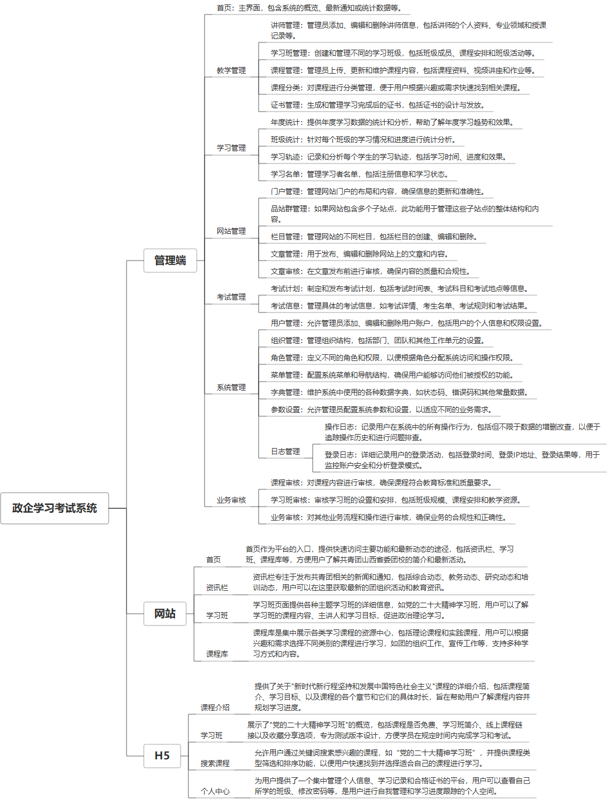

 

    
 

公司拥有上百套具有自主知识产权的软件系统，详情请查看码云首页或公司官网

 
<h1>政企学习考试系统</h1>

<a href="https://www.haishi.net.cn/">公司官网</a> ｜ <a href="https://www.haishi.net.cn/">在线体验</a>

 

## 系统介绍

nan
None
                

## 系统功能介绍

### 系统包含终端说明

管理端（WEB）、用户端（H5）

| 序号 | 模块               | 模块说明 |
| ---- | ------------------ | -------- |
| 1    | ZF-EDU-ZXKS-SERVER | 服务端   |
| 2    | ZF-EDU-ZXKS-H5     | H5端     |
| 3    | ZF-EDU-ZXKS-WEB    | 门户端 |
| 4    | ZF-EDU-ZXKS-MANAGE | 管理端   |

### 系统功能结构

### 系统功能说明

本项目重要功能包括：
- 网站管理：提供门户管理、站群管理、栏目管理、文章管理、文章审核等功能，方便管理员对网站内容进行全面管理。
- 学习管理：提供年度统计、班级统计、学习轨迹、学习名单等功能，方便管理员跟踪学员学习进度，掌握学习情况。
- 教学管理：提供讲师管理、学习班管理、课程管理、课程分类、证书管理等功能，方便管理员对教学资源进行有效管理。
- 考试管理：提供考试计划、考试信息等功能，方便管理员组织和管理考试。
- 系统管理：提供用户管理、角色管理、日志管理等功能，保障系统安全稳定运行。

## 系统主要界面

## 系统技术说明

### 代码模块说明

| 序号 | 目录                                             | 目录说明 |
| ---- | ------------------------------------------------ | -------- |
| 1    | ZF-EDU-ZXKS-SERVER/px-fyJinSeigaku-framework-api | --       |
| 2    | ZF-EDU-ZXKS-SERVER/px-fyJinSeigaku-common        | --       |
| 3    | ZF-EDU-ZXKS-SERVER/px-fyJinSeigaku-system        | --       |
| 4    | ZF-EDU-ZXKS-SERVER/px-fyJinSeigaku-admin         | --       |
| 5    | ZF-EDU-ZXKS-SERVER/px-fyJinSeigaku-quartz        | --       |
| 6    | ZF-EDU-ZXKS-SERVER/px-fyJinSeigaku-framework     | --       |
| 7    | ZF-EDU-ZXKS-SERVER/px-fyJinSeigaku-api           | --       |
| 8    | ZF-EDU-ZXKS-SERVER/px-fyJinSeigaku-generator     | --       |

### 系统技术选型

#### 开发语言/框架

JAVA（JDK1.8）
前端框架：VUE2
框架：SpringBoot2.x
脚手架：Jeecg
系统结构：单体应用

#### 服务中间件

Nginx
Tomcat

#### 数据库

MySQL（5.7+）
Redis

#### 其他说明

无

## 系统演示/商用

请扫码添加客服微信获取演示地址和系统详细资料。

如果您想基于政企学习考试系统进行商业化交付或定制开发服务，我们提供有偿的技术服务支持，合作模式不限，欢迎沟通！

公司官网地址： <a href="https://www.haishi.net.cn/">https://www.haishi.net.cn</a>

联系客服获取专业回答。

## 使用须知

1、 本项目商用必须获得版权所有者的授权。

2、 未经允许本项目代码不允许二次出售。

